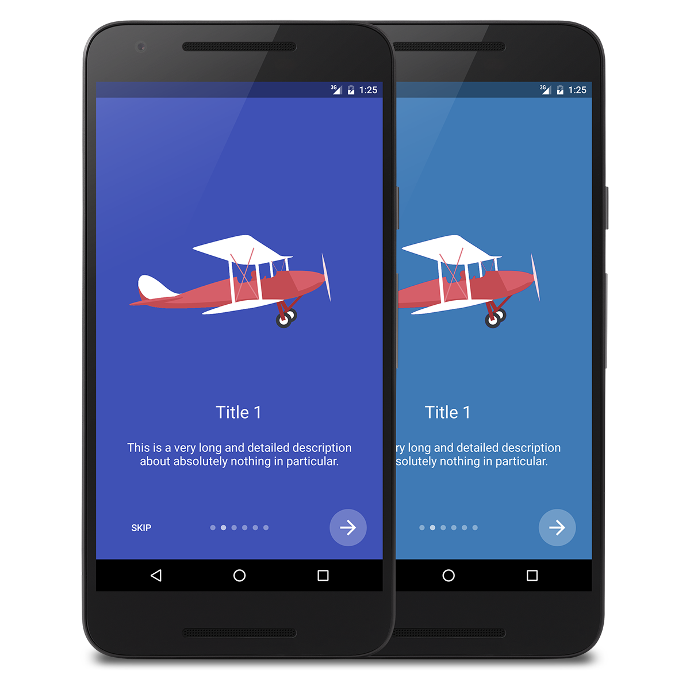

# IntroActivity
The IntroActivity library allows you to easily create beautiful intro screens for your app.



Airplane vector image designed by [Freepik](http://www.freepik.com/free-vector/light-airplane-with-banners_796772.htm#term=airplane&page=1&position=25).

### YouTube demo


Watch it on [YouTube](https://www.youtube.com/watch?v=4vUe8xVAEIM).

## How do I use IntroActivity?
Simple. Just create an `Activity` and extend `IntroActivity.`

By extending `IntroActivity`, you'll automatically implement the `initialize()` method. This is where you set up your intro screens and any custom styling. It is not possible to override `onCreate()` as this is used by the library to set up your intro screen.

Here's an example of how to extend `IntroActivity` and add a basic intro screen:

```java
public class DemoActivity extends IntroActivity {

    @Override
    protected void initialize() {
        String description = "This is a description.";

        // Intro screen with title and description
        addIntroScreen(
                IntroFragment.newInstance("Title", description),
                ContextCompat.getColor(this, R.color.material_blue)
        );
    }
    
}
```

### Gradle dependency
Add the following to your top level build.gradle

    allprojects {
        repositories {
            ...
            maven { url "https://jitpack.io" }
        }
    }

Add the following dependency

    compile 'com.github.MizzleDK:IntroActivity:-SNAPSHOT'

## Custom styling
The library allows you to perform various custom styling using the following methods:

- `setShowSkipButton(boolean showSkipButton)`
- `setShowNextButton(boolean showNextButton)`
- `setSkipButtonTextColor(int color)`
- `setNextButtonBackgroundColor(int color)`
- `setNextButtonIconColor(int color)`
- `setProgressCircleColor(int color)`


## Handling button click events
When you extend `IntroActivity`, you'll need to implement a few methods as well. These are:

- `onSkipPressed()`
- `onNextPressed(int)`
- `onDonePressed()`

The methods are called when the user presses the Skip button, Next button and Done button, respectively.

## Example
The `app` folder of the repo contains a simple demo app with six intro screens, showcasing the different options.
